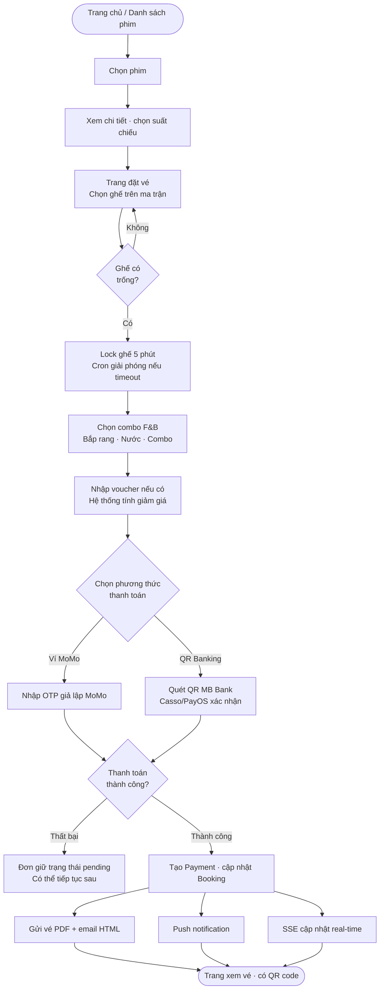
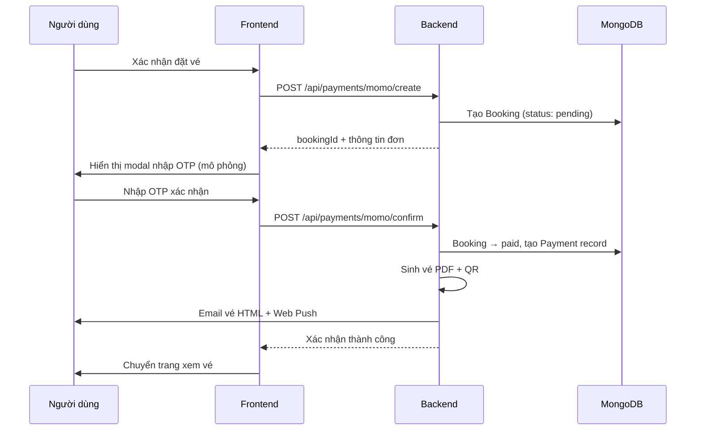
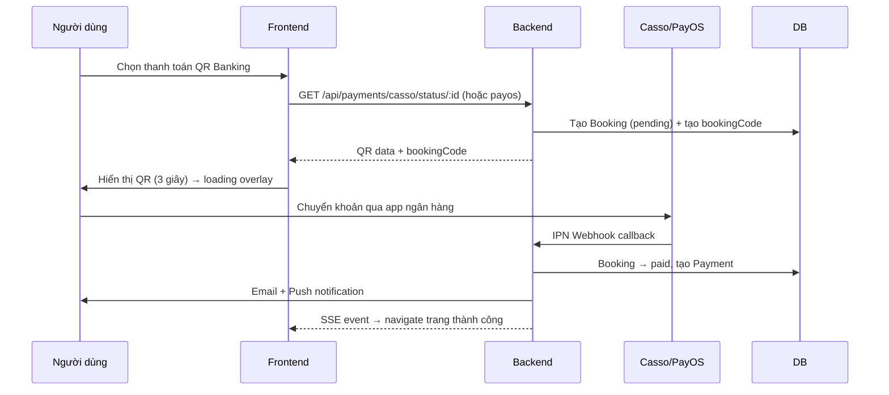

# 5Cine — Tổng Quan Dự Án

> Hệ thống đặt vé xem phim trực tuyến, gồm website người dùng và trang quản trị admin.
> Dự án DATN — Cinema Booking System.

---

## Stack công nghệ

| Tầng       | Công nghệ                                          | Vai trò                                     |
| ---------- | -------------------------------------------------- | ------------------------------------------- |
| Frontend   | React 19 · Vite · Tailwind CSS · React Router v7   | Giao diện người dùng (SPA)                  |
| Backend    | Node.js · Express v5                               | REST API server                             |
| Database   | MongoDB Atlas · Mongoose                           | Lưu trữ dữ liệu (cloud)                     |
| Auth       | JWT · bcryptjs · Nodemailer                        | Xác thực · mã hóa mật khẩu · gửi OTP email  |
| Realtime   | Socket.IO · SSE (Server-Sent Events)               | Thông báo admin · cập nhật trạng thái vé    |
| Thanh toán | MoMo API · PayOS · Casso                           | Ví điện tử + chuyển khoản QR ngân hàng      |
| Thông báo  | Web Push (VAPID)                                   | Push notification trên trình duyệt          |
| Vé PDF     | PDFKit · QRCode                                    | Xuất vé điện tử có mã QR                    |
| Quét vé    | html5-qrcode                                       | Đọc QR bằng camera trình duyệt              |

---

## Cấu trúc thư mục

```
cine-clone/
├── BE/                         # Backend (Node.js + Express)
│   ├── app.js                  # Entry point, đăng ký routes & middleware
│   ├── config/database.js      # Kết nối MongoDB
│   ├── models/                 # Mongoose schemas (14 models)
│   ├── routes/                 # API route handlers (14 nhóm)
│   ├── controllers/            # Business logic tách riêng (7 controllers)
│   ├── services/               # Email · Push · Notification · Voucher
│   ├── middleware/auth.js       # JWT verify, phân quyền user/admin
│   ├── jobs/                   # Cron jobs tự động (6 jobs)
│   ├── utils/                  # pricing · seat-validator · vietnamese-holidays ...
│   └── scripts/                # Debug & seed scripts
│
├── FE/                         # Frontend (React + Vite)
│   ├── src/
│   │   ├── api/axiosConfig.js  # Axios instance: auth header, retry, redirect
│   │   ├── pages/              # 24 page components
│   │   ├── components/         # Reusable components (admin tabs, modals, ...)
│   │   ├── hooks/              # Custom React hooks
│   │   └── utils/              # vietnamese-holidays, isShowtimeLocked, ...
│   └── public/                 # Static assets
│
└── docs/                       # Tài liệu dự án
```

---

## Kiến trúc hệ thống

```
┌─────────────────────────────────────────────────┐
│                 Client (React SPA)               │
│                                                  │
│  Người dùng          Admin Dashboard             │
└───────┬──────────────────────┬───────────────────┘
        │                      │
        │  HTTP REST / SSE      │
        ▼                      ▼
┌─────────────────────────────────────────────────┐
│              Express v5  (Node.js)               │
│                                                  │
│  /api/auth       /api/movies     /api/bookings   │
│  /api/showtimes  /api/payments   /api/tickets    │
│  /api/reviews    /api/vouchers   /api/push       │
│  /api/admin      SSE streams     Socket.IO       │
└───────────────────────┬─────────────────────────┘
                        │
                        ▼
┌─────────────────────────────────────────────────┐
│              MongoDB Atlas (Cloud)               │
│                                                  │
│  User · Movie · Cinema · CinemaRoom · Seat       │
│  Showtime · Booking · Payment · Review           │
│  Voucher · VoucherUsage · Genre                  │
│  PushSubscription · PendingRegistration          │
└─────────────────────────────────────────────────┘

Kênh realtime:
  SSE  ──→ /bookings/:id/stream         (trạng thái vé user)
  SSE  ──→ /admin/notifications/stream  (thông báo admin)
  Push ──→ VAPID → Browser Push API     (web push notification)
```

---

## Luồng đặt vé



---

## Luồng thanh toán

### MoMo (giả lập)



### QR Banking (Casso / PayOS)



---

## Trạng thái đơn hàng (Booking)

```
                    ┌─────────┐
          ┌────────▶│ pending │◀──────────────┐
          │         └────┬────┘               │
          │   timeout    │ thanh toán OK  tiếp tục TT
          │   (5 phút)   ▼                    │
          │         ┌─────────┐               │
          │    ┌───▶│  paid   │               │
          │    │    └────┬────┘               │
          │    │         │ admin hoàn tiền     │
          │    │         ▼                    │
┌─────────┴┐   │    ┌──────────┐              │
│ expired  │   │    │ refunded │              │
└──────────┘   │    └──────────┘              │
               │                              │
          ┌────┴──────┐
          │ cancelled │  (admin hủy suất chiếu)
          └───────────┘
```

| Trạng thái  | Ý nghĩa                      | Hành động tiếp theo                |
| ----------- | ---------------------------- | ---------------------------------- |
| `pending`   | Đã giữ ghế, chưa thanh toán  | Thanh toán hoặc tự hủy sau 5 phút  |
| `paid`      | Đã thanh toán                | Xem vé · in vé · quét soát vé      |
| `expired`   | Hết 5 phút không thanh toán  | Có thể đặt lại                     |
| `cancelled` | Admin hủy suất chiếu         | Tự động chuyển sang refunded nếu đã paid |
| `refunded`  | Admin hoàn tiền              | —                                  |

---

## Tính năng người dùng

### Xác thực & Tài khoản

- Đăng ký · đăng nhập dạng modal (popup tại chỗ, không chuyển trang)
- Xác thực email OTP · quên mật khẩu qua OTP · đổi mật khẩu
- Cập nhật thông tin cá nhân trong trang Profile

**Phân quyền:**

| Role    | Quyền                                                  |
| ------- | ------------------------------------------------------ |
| `user`  | Đặt vé · xem lịch sử · đánh giá phim · nhận thông báo |
| `admin` | Toàn bộ quyền user + quản lý toàn hệ thống             |

### Phim & Rạp

- Danh sách phim đang chiếu / sắp chiếu · chi tiết phim · trailer YouTube
- Lịch chiếu theo rạp hoặc theo phim · auto-refresh 5 giây (polling) + tick 1 giây cho khóa vé
- Đánh giá phim (chỉ mở sau khi suất chiếu kết thúc — kiểm tra `endTime` qua DB)

### Đặt vé

- Chọn ghế trực quan trên ma trận (thường / VIP / đôi / lối đi)
- Giữ ghế tạm 5 phút · tự giải phóng nếu không thanh toán
- Thêm combo F&B (bắp rang, nước, combo) vào đơn

**Ví dụ ma trận ghế (8 hàng × 10 cột):**

```
              ══════════ MÀN HÌNH ══════════

      A1   A2   A3   A4   A5   A6   A7   A8   A9   A10   ← Thường
      B1   B2   B3   B4   B5   B6   B7   B8   B9   B10   ← Thường
      C1   C2   C3   C4   C5   C6   C7   C8   C9   C10   ← Thường
      D1   D2   D3   D4   D5   D6   D7   D8   D9   D10   ← Thường
      E1   E2   E3   E4   E5   E6   E7   E8   E9   E10   ← Thường
      F1   F2   F3   F4   F5   F6   F7   F8   F9   F10   ← Thường
      G1   G2   G3   G4   G5   G6   G7   G8   G9   G10   ← VIP ★
      H1   H2        H3   H4   H5   H6        H7   H8    ← Đôi ♥

Chú thích: □ Trống  ■ Đã đặt  ▣ Đang giữ  ░ Lối đi
```

### Giá vé động

Công thức: `Giá gốc × Hệ số khung giờ × Hệ số loại ngày × Hệ số loại ghế`

| Khung giờ        | Hệ số |
| ---------------- | ----- |
| Sáng (< 12:00)   | ×1.0  |
| Chiều (12–17:59) | ×1.0  |
| Tối (18–21:59)   | ×1.1  |
| Đêm (≥ 22:00)    | ×1.2  |

| Loại ngày   | Hệ số |
| ----------- | ----- |
| Ngày thường | ×1.0  |
| Cuối tuần   | ×1.2  |
| Ngày lễ     | ×1.5  |

| Loại ghế  | Hệ số |
| --------- | ----- |
| Thường    | ×1.0  |
| VIP       | ×1.5  |
| Đôi       | ×2.0  |

**Ngày lễ Việt Nam được tích hợp:**

| Ngày lễ                                        | Ngày                                        |
| ---------------------------------------------- | ------------------------------------------- |
| Tết Dương lịch                                 | 1/1                                         |
| Ngày Giải phóng miền Nam, thống nhất đất nước  | 30/4                                        |
| Quốc tế Lao động                               | 1/5                                         |
| Quốc khánh                                     | 2/9 + 3/9                                   |
| Tết Nguyên Đán                                 | 5 ngày/năm (30 Tết + Mùng 1–4) — 2024–2030  |
| Giỗ Tổ Hùng Vương                              | 10/3 âm lịch — 2024–2030                    |

### Khuyến mãi & Giảm giá

- **Gold Monday**: tự động giảm 20% tổng đơn khi suất chiếu vào Thứ Hai
- **Mã voucher**: nhập mã tại trang đặt vé, hỗ trợ giảm theo % hoặc số tiền cố định, có thể stack với Gold Monday

| Thuộc tính voucher  | Mô tả                                                               |
| ------------------- | ------------------------------------------------------------------- |
| `type: percent`     | Giảm X% tổng đơn (đặt `maxDiscount` để chặn giảm quá nhiều)        |
| `type: fixed`       | Giảm số tiền cố định                                                |
| `minOrderAmount`    | Đơn tối thiểu để áp dụng mã                                         |
| `totalUsageLimit`   | Tổng số lượt dùng cho tất cả user                                   |
| `maxUsagePerUser`   | Mỗi user được dùng tối đa N lần                                     |
| `expiresAt`         | Ngày hết hạn                                                        |

### Thanh toán & Đơn hàng

- Thanh toán qua **MoMo** (tạo đơn → xác nhận OTP giả lập)
- Thanh toán qua **QR Banking** (Casso / PayOS webhook IPN)
- Tiếp tục thanh toán đơn còn pending · hủy đơn thủ công
- Lịch sử đặt vé với bộ lọc theo trạng thái

### Vé

- In vé PDF có mã QR · nhận vé qua email HTML
- Xem vé online qua link JWT riêng (hết hạn 7 ngày, không cần đăng nhập)
- Nhân viên quét QR bằng camera để soát vé tại rạp (`/scan`)

### Thông báo

| Kênh                | Khi nào kích hoạt                                                                                 |
| ------------------- | ------------------------------------------------------------------------------------------------- |
| Web Push            | Đơn được xác nhận / hủy / hoàn tiền                                                               |
| Email vé            | Ngay sau khi thanh toán thành công                                                                |
| Email nhắc lịch     | Trước suất chiếu 24 giờ (flag `reminder24hSentAt` tránh gửi lại)                                  |
| Email nhắc đánh giá | Sau khi suất chiếu kết thúc (flag `reviewReminderSentAt` tránh gửi lại)                           |
| SSE real-time       | Trạng thái vé thay đổi (không cần reload trang)                                                   |

---

## Tính năng admin

### Dashboard thống kê

| Chỉ số        | Dữ liệu hiển thị                              |
| ------------- | --------------------------------------------- |
| Doanh thu vé  | Tổng tiền từ booking `status=paid`            |
| Doanh thu F&B | Tổng từ `extraItems` trong các đơn paid       |
| Top phim      | Xếp hạng theo doanh thu, có thanh bar chart   |
| Khung giờ     | Suất chiếu nào được đặt nhiều nhất            |
| Hoàn tiền     | Số đơn + tổng tiền đã hoàn                    |

### Quản lý phim

- CRUD phim: poster, backdrop, trailer, thể loại, độ tuổi, thời lượng, ngày phát hành
- Phim `coming_soon` tự chuyển `now_showing` đúng ngày phát hành (cron job)
- Duyệt / xóa đánh giá phim

### Quản lý rạp & phòng

| Thao tác             | Mô tả                                                                             |
| -------------------- | --------------------------------------------------------------------------------- |
| Đóng rạp khẩn cấp    | Tự hủy tất cả suất sắp tới + hoàn tiền đơn paid                                  |
| Đóng phòng           | Chọn 1 hoặc nhiều phòng, preview suất bị ảnh hưởng trước khi xác nhận            |
| Mở phòng             | Khôi phục phòng về hoạt động, rạp tự khôi phục nếu đủ điều kiện                  |
| Cấu hình ghế         | Click từng ô ma trận để đổi loại: thường / VIP / đôi / lối đi                    |
| Xem trạng thái ghế   | Chọn suất chiếu → xem toàn bộ ghế với màu sắc real-time                          |

**Màu trạng thái ghế trong admin:**

| Màu       | Trạng thái                  |
| --------- | --------------------------- |
| Xanh lá   | Trống                       |
| Vàng      | Đang giữ (pending booking)  |
| Xám đậm   | Đã đặt (paid)               |
| Xám nhạt  | Bảo trì / lối đi (locked)   |

### Quản lý suất chiếu

- Tạo suất chiếu đơn lẻ hoặc hàng loạt (bulk — nhiều ngày trong tuần)
- Giờ kết thúc tự tính: `startTime + durationMinutes + 20 phút buffer`
- **Kiểm tra trùng giờ theo phòng**: nếu phòng đã có suất chiếu trong khung giờ đó, thông báo lỗi rõ ràng — liệt kê tên phim và khung giờ đang chặn (ví dụ: *"Suất 10:00 bị trùng với "The Ring" (09:30 → 11:40) — phòng chưa trống"*)
- Hủy suất chiếu + tự động hoàn tiền tất cả đơn paid
- Bulk cancel + bulk delete nhiều suất cùng lúc

### Quản lý vận hành

- Xem đơn hàng · xác nhận đơn · đánh dấu đã in vé · khóa ghế thủ công
- Quản lý người dùng (xem, sửa, xóa)
- Thông báo realtime qua SSE khi có sự kiện mới

### Quản lý Voucher

- Tạo mã giảm giá với đầy đủ điều kiện (loại, giá trị, hạn dùng, lượt dùng)
- Toggle bật/tắt voucher · xóa voucher
- Theo dõi số lượt đã sử dụng theo user

---

## Cron Jobs tự động (6 jobs)

| Job                       | Tần suất          | Chức năng                                                                              |
| ------------------------- | ----------------- | -------------------------------------------------------------------------------------- |
| `expire-bookings`         | Mỗi phút          | Hủy đơn pending quá 5 phút, giải phóng ghế về trạng thái trống                        |
| `expire-showtimes`        | Định kỳ           | Chuyển suất chiếu đã qua thành `expired`                                               |
| `expire-movies`           | Hàng ngày         | Tự ẩn phim hết lịch chiếu                                                              |
| `update-movie-status`     | Hàng ngày         | Phim `coming_soon` tự chuyển `now_showing` đúng ngày phát hành                        |
| `send-upcoming-reminders` | Mỗi 5 phút        | Email nhắc khách trước suất chiếu 24 giờ (flag `reminder24hSentAt` tránh gửi lại)     |
| `send-review-reminders`   | Hàng ngày         | Email nhắc đánh giá sau khi phim kết thúc (flag `reviewReminderSentAt` tránh gửi lại) |

---

## Database Models (14 Models)

| Model                  | Các trường chính                                                                                                                                                                    |
| ---------------------- | ----------------------------------------------------------------------------------------------------------------------------------------------------------------------------------- |
| `User`                 | `name` · `email` · `password` (hashed) · `phone` · `role` (user/admin) · `isVerified` · `resetOtp` · `profileHistory`                                                             |
| `Movie`                | `title` · `poster` · `backdrop` · `trailer` · `duration` · `releaseDate` · `status` (now_showing/coming_soon/stopped) · `genres[]` · `ageRestriction` · `rating` · `screeningEndDate` |
| `Cinema`               | `name` · `address` · `location` · `phone` · `image` · `city` · `totalRooms` · `status` (active/incident/inactive)                                                                  |
| `CinemaRoom`           | `cinema` · `name` · `rows` · `cols` · `totalSeats` · `roomType` (Standard/Premium/VIP) · `seatMatrix[][]` · `status` (active/maintenance)                                         |
| `Seat`                 | `showtime` · `room` · `row` · `col` · `seatNumber` · `type` (normal/vip/couple) · `status` (available/reserved/booked) · `isLocked` · `bookedBy` · `price`                        |
| `Showtime`             | `movie` · `cinema` · `room` · `date` · `startTime` · `endTime` · `basePrice` · `priceConfig` {normal/vip/couple} · `timeSlot` · `dayType` · `totalSeats` · `availableSeats` · `status` · `bookingLockMinutes` |
| `Booking`              | `user` · `showtime` · `seats[]` · `seatNumbers[]` · `totalPrice` · `status` (pending/paid/cancelled/expired/refunded) · `bookingCode` · `expiresAt` · `voucher` · `voucherDiscount` · `extraItems[]` · `reminder24hSentAt` · `reviewReminderSentAt` |
| `Payment`              | `booking` · `user` · `method` (momo/qr/credit_card/cash) · `amount` · `status` (pending/success/failed/refunded) · `transactionId` · `refundAmount` · `refundDate`                |
| `Review`               | `user` · `movie` · `rating` (1–5) · `comment` (max 500 chars) — unique per user per movie                                                                                          |
| `Voucher`              | `code` · `type` (percent/fixed) · `value` · `minOrderAmount` · `maxDiscount` · `expiresAt` · `totalUsageLimit` · `totalUsedCount` · `maxUsagePerUser` · `uniqueUserCount` · `status` (active/inactive/draft/archived) · `description` |
| `VoucherUsage`         | `voucher` · `user` · `usageCount` · `lastUsedAt` — unique index (voucher, user)                                                                                                    |
| `Genre`                | `name` (unique) · `description`                                                                                                                                                     |
| `PendingRegistration`  | `email` · `name` · `password` (hashed) · `phone` · `otp` · `otpExpiry` · `createdAt` (TTL: 15 phút)                                                                               |
| `PushSubscription`     | `bookingCode` · `endpoint` · `keys` {p256dh, auth} · `createdAt` (TTL: 7 ngày)                                                                                                    |

---

## API Endpoints chính

| Nhóm      | Endpoint                                | Mô tả                                        |
| --------- | --------------------------------------- | -------------------------------------------- |
| Auth      | `POST /api/auth/register`               | Đăng ký → gửi OTP email                      |
| Auth      | `POST /api/auth/login`                  | Đăng nhập · nhận JWT                         |
| Auth      | `POST /api/auth/verify-email`           | Xác thực OTP email                           |
| Auth      | `POST /api/auth/forgot-password`        | Gửi OTP đặt lại mật khẩu                     |
| Movies    | `GET /api/movies`                       | Danh sách phim (filter status/genre)         |
| Movies    | `GET /api/movies/:id`                   | Chi tiết phim                                |
| Showtimes | `GET /api/showtimes`                    | Lịch chiếu (filter movieId/cinemaId/date)    |
| Showtimes | `POST /api/showtimes`                   | Admin: tạo suất (đơn lẻ hoặc bulk array)     |
| Showtimes | `PUT /api/showtimes/:id/cancel`         | Admin: hủy suất + hoàn tiền                  |
| Bookings  | `POST /api/bookings`                    | Tạo đơn đặt vé · lock ghế 5 phút             |
| Bookings  | `GET /api/bookings/user/all`            | Lịch sử đặt vé                               |
| Bookings  | `GET /api/bookings/:id/stream`          | SSE stream trạng thái vé                     |
| Payments  | `POST /api/payments/momo/create`        | Khởi tạo giao dịch MoMo                      |
| Payments  | `POST /api/payments/momo/confirm`       | Xác nhận OTP MoMo                            |
| Payments  | `POST /api/payments/payos`             | Tạo đơn QR Banking (PayOS)                   |
| Payments  | `POST /api/payments/casso/webhook`     | Casso IPN webhook callback                   |
| Tickets   | `GET /api/tickets/:bookingId/pdf`       | Tải vé PDF                                   |
| Tickets   | `POST /api/tickets/:bookingId/email`    | Gửi vé qua email                             |
| Tickets   | `POST /api/tickets/scan`               | Soát vé bằng QR                              |
| Reviews   | `POST /api/reviews`                     | Gửi đánh giá phim                            |
| Vouchers  | `POST /api/vouchers/validate`           | Kiểm tra mã + trả về discountAmount          |
| Vouchers  | `GET /api/admin/vouchers`              | Admin: danh sách tất cả voucher              |
| Vouchers  | `POST /api/admin/vouchers`             | Admin: tạo voucher mới                       |
| Push      | `POST /api/push/subscribe`             | Đăng ký push notification                    |
| Admin     | `GET /api/admin/reports/revenue`        | Báo cáo doanh thu                            |
| Admin     | `POST /api/admin/emergency-close/:id`   | Đóng rạp khẩn cấp                            |
| Admin     | `POST /api/admin/rooms/reopen`          | Mở lại phòng                                 |

---

## Cách khởi động

**Backend** (cổng 5000):

```bash
cd BE
npm install
node app.js         # production
# hoặc
npx nodemon app.js  # development (auto-reload)
```

**Frontend** (cổng 5173):

```bash
cd FE
npm install
npm run dev
```

Truy cập: `http://localhost:5173`

### Tài khoản mặc định

| Loại        | Email               | Mật khẩu |
| ----------- | ------------------- | -------- |
| Admin       | `admin@cinema.com`  | `123456` |
| User thường | Tự đăng ký          | —        |

> Admin dashboard: `http://localhost:5173/admin`

---

## Environment Variables

**BE `.env`:**

```env
PORT=5000
MONGO_URI=                  # MongoDB Atlas connection string
JWT_SECRET=                 # JWT signing secret
EMAIL_USER=                 # Gmail address for Nodemailer
EMAIL_PASS=                 # Gmail App Password
MOMO_PARTNER_CODE=
MOMO_ACCESS_KEY=
MOMO_SECRET_KEY=
PAYOS_CLIENT_ID=
PAYOS_API_KEY=
PAYOS_CHECKSUM_KEY=
VAPID_PUBLIC_KEY=           # Web Push VAPID key
VAPID_PRIVATE_KEY=
```

**FE `.env`:**

```env
VITE_API_URL=http://localhost:5000/api
```

---

## Môi trường triển khai

| Môi trường  | Nền tảng          | URL                                              |
| ----------- | ----------------- | ------------------------------------------------ |
| FE          | Vercel            | https://cine-clone-kappa.vercel.app/             |
| BE          | ngrok tunnel      | https://antitrust-sprawl-gliding.ngrok-free.dev  |
| Local FE    | localhost         | http://localhost:5173                            |
| Local BE    | localhost         | http://localhost:5000                            |

> BE chạy local và expose ra internet qua **ngrok** để nhận IPN webhook callback từ PayOS / Casso.  
> `SERVER_URL` trong `.env` trỏ đến ngrok URL, cần cập nhật mỗi khi ngrok tunnel restart (free plan đổi URL).

---

## Giới hạn hiện tại (Phạm vi DATN)

| Hạng mục                        | Trạng thái                                                        |
| ------------------------------- | ----------------------------------------------------------------- |
| Deploy production cloud         | FE trên Vercel. BE chạy local, expose qua ngrok tunnel (chưa deploy lên server thật) |
| PayOS / Casso                   | Đang dùng **sandbox** / test mode, chưa kết nối production        |
| App mobile native (iOS/Android) | Chưa có — chỉ có web app (responsive)                             |
| Đề xuất phim (AI/ML)            | Chưa có                                                           |
| Đa ngôn ngữ (i18n)              | Chưa có — toàn bộ giao diện bằng tiếng Việt                       |
