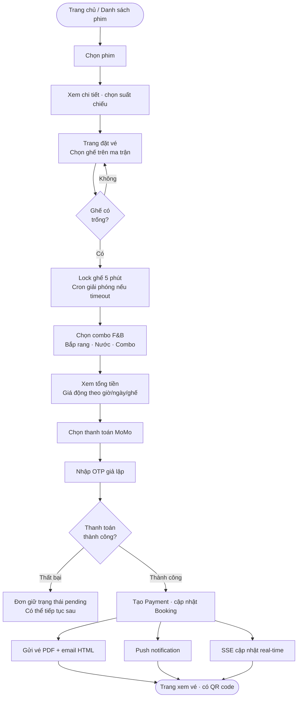
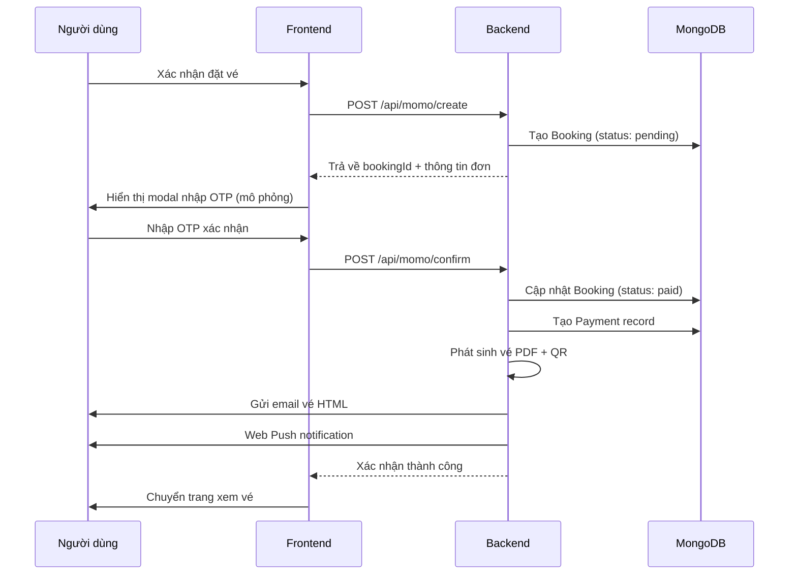

# 5Cine — Tổng Quan Dự Án

> Hệ thống đặt vé xem phim trực tuyến, gồm website người dùng và trang quản trị admin.

---

## Stack công nghệ

| Tầng | Công nghệ | Vai trò |
|---|---|---|
| Frontend | React 19 · Vite · Tailwind CSS · React Router v7 | Giao diện người dùng (SPA) |
| Backend | Node.js · Express v5 | REST API server |
| Database | MongoDB Atlas · Mongoose | Lưu trữ dữ liệu (cloud) |
| Auth | JWT · bcryptjs · Nodemailer | Xác thực · mã hóa mật khẩu · gửi OTP email |
| Realtime | Socket.IO · SSE | Cập nhật trạng thái thời gian thực |
| Thanh toán | MoMo API | Mô phỏng thanh toán điện tử |
| Thông báo | Web Push (VAPID) | Push notification trên trình duyệt |
| Vé PDF | PDFKit · QRCode | Xuất vé có mã QR |
| Quét vé | html5-qrcode | Đọc QR bằng camera trình duyệt |

---

## Kiến trúc hệ thống

```
┌─────────────────────────────────────────────────┐
│                 Client (React SPA)               │
│                                                  │
│  Người dùng          Admin Dashboard             │
└───────┬──────────────────────┬───────────────────┘
        │                      │
        │  HTTP / REST API      │
        ▼                      ▼
┌─────────────────────────────────────────────────┐
│              Express v5  (Node.js)               │
│                                                  │
│  /api/auth      /api/movies    /api/bookings     │
│  /api/showtimes /api/payments  /api/tickets      │
│  /api/momo      /api/reviews   /api/admin        │
│  /api/push      SSE streams                      │
└───────────────────────┬─────────────────────────┘
                        │
                        ▼
┌─────────────────────────────────────────────────┐
│              MongoDB Atlas (Cloud)               │
│                                                  │
│  User · Movie · Cinema · CinemaRoom · Seat       │
│  Showtime · Booking · Payment · Review           │
│  Genre · PushSubscription · PendingRegistration  │
└─────────────────────────────────────────────────┘

Kênh realtime:
  SSE  ──→ /bookings/:id/stream         (trạng thái vé user)
  SSE  ──→ /admin/notifications/stream  (thông báo admin)
  Push ──→ VAPID → Browser Push API     (web push notification)
```

---

## Luồng đặt vé



---

## Luồng thanh toán MoMo



---

## Trạng thái đơn hàng (Booking)

```
                    ┌─────────┐
          ┌────────▶│ pending │◀──────────────┐
          │         └────┬────┘               │
          │   timeout    │ thanh toán OK  tiếp tục TT
          │   (5 phút)   ▼                    │
          │         ┌─────────┐               │
          │    ┌───▶│  paid   │               │
          │    │    └────┬────┘               │
          │    │         │ admin hoàn tiền     │
          │    │         ▼                    │
┌─────────┴┐   │    ┌──────────┐              │
│ expired  │   │    │ refunded │              │
└──────────┘   │    └──────────┘              │
               │                              │
          ┌────┴──────┐                       │
          │ cancelled │───────────────────────┘
          └───────────┘
```

| Trạng thái | Ý nghĩa | Hành động tiếp theo |
|---|---|---|
| `pending` | Đã giữ ghế, chưa thanh toán | Thanh toán hoặc tự hủy sau 5 phút |
| `paid` | Đã thanh toán | Xem vé · in vé · quét soát vé |
| `cancelled` | Người dùng hủy thủ công | — |
| `expired` | Hết 5 phút không thanh toán | Có thể đặt lại |
| `refunded` | Admin hoàn tiền | — |

---

## Tính năng người dùng

**Xác thực & Tài khoản**
- Đăng ký · đăng nhập dạng modal (popup tại chỗ, không chuyển trang)
- Xác thực email OTP · quên mật khẩu qua OTP · đổi mật khẩu
- Cập nhật thông tin cá nhân trong trang Profile

**Phân quyền:**

| Role | Quyền |
|---|---|
| `user` | Đặt vé · xem lịch sử · đánh giá phim · nhận thông báo |
| `admin` | Toàn bộ quyền user + quản lý toàn hệ thống |

**Phim & Rạp**
- Danh sách phim đang chiếu / sắp chiếu · chi tiết phim · trailer
- Lịch chiếu theo rạp hoặc theo phim
- Đánh giá phim (chỉ mở sau khi suất chiếu kết thúc — kiểm tra `endTime` suất chiếu qua DB)

**Đặt vé**
- Chọn ghế trực quan trên ma trận (thường / VIP / đôi)
- Giữ ghế tạm 5 phút · tự giải phóng nếu không thanh toán
- Thêm combo F&B (bắp rang, nước, combo) vào đơn

Ví dụ ma trận ghế (8 hàng × 10 cột):

```
              ══════════ MÀN HÌNH ══════════

      A1   A2   A3   A4   A5   A6   A7   A8   A9   A10   ← Thường
      B1   B2   B3   B4   B5   B6   B7   B8   B9   B10   ← Thường
      C1   C2   C3   C4   C5   C6   C7   C8   C9   C10   ← Thường
      D1   D2   D3   D4   D5   D6   D7   D8   D9   D10   ← Thường
      E1   E2   E3   E4   E5   E6   E7   E8   E9   E10   ← Thường
      F1   F2   F3   F4   F5   F6   F7   F8   F9   F10   ← Thường
      G1   G2   G3   G4   G5   G6   G7   G8   G9   G10   ← VIP ★
      H1   H2        H3   H4   H5   H6        H7   H8    ← Đôi ♥

Chú thích: □ Trống  ■ Đã đặt  ▣ Đang giữ  ░ Bảo trì
```

**Giá vé động** — công thức: `Giá gốc × Khung giờ × Loại ngày × Loại ghế`

Bảng giá ví dụ (giá gốc 80,000đ):

| Giờ chiếu | Loại ngày | Ghế thường | Ghế VIP (×1.5) | Ghế đôi (×2.0) |
|---|---|---|---|---|
| Sáng < 12:00 | Ngày thường | 80,000đ | 120,000đ | 160,000đ |
| Chiều 12–18h | Ngày thường | 88,000đ (×1.1) | 132,000đ | 176,000đ |
| Tối > 18:00 | Ngày thường | 96,000đ (×1.2) | 144,000đ | 192,000đ |
| Sáng < 12:00 | Cuối tuần | 96,000đ (×1.2) | 144,000đ | 192,000đ |
| Chiều 12–18h | Cuối tuần | 105,600đ (×1.32) | 158,400đ | 211,200đ |
| Tối > 18:00 | Cuối tuần | 115,200đ (×1.44) | 172,800đ | 230,400đ |
| Sáng < 12:00 | Ngày lễ | 120,000đ (×1.5) | 180,000đ | 240,000đ |
| Chiều 12–18h | Ngày lễ | 132,000đ (×1.65) | 198,000đ | 264,000đ |
| Tối > 18:00 | Ngày lễ | 144,000đ (×1.8) | 216,000đ | 288,000đ |

Danh sách ngày lễ Việt Nam được tích hợp:

| Ngày lễ | Ngày |
|---|---|
| Tết Dương lịch | 1/1 |
| Ngày Giải phóng miền Nam, thống nhất đất nước | 30/4 |
| Quốc tế Lao động | 1/5 |
| Quốc khánh | 2/9 + 3/9 |
| Tết Nguyên Đán | 5 ngày/năm (30 Tết + Mùng 1–4) — 2024–2030 |
| Giỗ Tổ Hùng Vương | 10/3 âm lịch — 2024–2030 |

**Khuyến mãi & Giảm giá**
- **Gold Monday**: tự động giảm 20% tổng đơn khi suất chiếu vào Thứ Hai (tính theo giờ Việt Nam)
- **Mã voucher**: nhập mã tại trang đặt vé (step 2), hỗ trợ giảm theo % hoặc số tiền cố định, có thể stack với Gold Monday

| Thuộc tính voucher | Mô tả |
|---|---|
| `type: percent` | Giảm X% tổng đơn (có thể đặt `maxDiscount` để chặn giảm quá nhiều) |
| `type: fixed` | Giảm số tiền cố định |
| `minOrderAmount` | Đơn tối thiểu để áp dụng mã |
| `usageLimit` | Tổng số lượt dùng cho tất cả user |
| `perUserLimit` | Mỗi user được dùng tối đa N lần |
| `expiresAt` | Ngày hết hạn |

**Thanh toán & Đơn hàng**
- Thanh toán qua MoMo (tạo đơn → xác nhận OTP → callback IPN)
- Tiếp tục thanh toán đơn còn pending · hủy đơn thủ công
- Lịch sử đặt vé với bộ lọc theo trạng thái

**Vé**
- In vé PDF có mã QR · nhận vé qua email HTML
- Xem vé online qua link JWT riêng (hết hạn 7 ngày, không cần đăng nhập)
- Nhân viên quét QR bằng camera để soát vé tại rạp

**Thông báo**

| Kênh | Khi nào kích hoạt |
|---|---|
| Web Push | Đơn được xác nhận / hủy / hoàn tiền |
| Email vé | Ngay sau khi thanh toán thành công |
| Email nhắc lịch | Trước suất chiếu 24 giờ (gửi đúng 1 lần) |
| Email nhắc đánh giá | Sau khi suất chiếu kết thúc — "Phim có hay không? Đánh giá giúp chúng tôi nhé!" (gửi đúng 1 lần) |
| SSE real-time | Trạng thái vé thay đổi (không cần reload trang) |

---

## Tính năng admin

**Dashboard thống kê**

| Chỉ số | Dữ liệu hiển thị |
|---|---|
| Doanh thu vé | Tổng tiền từ booking status=paid |
| Doanh thu F&B | Tổng từ extraItems trong các đơn paid |
| Top phim | Xếp hạng theo doanh thu, có thanh bar chart |
| Khung giờ | Suất chiếu nào được đặt nhiều nhất |
| Hoàn tiền | Số đơn + tổng tiền đã hoàn |

**Quản lý phim**
- CRUD phim: poster, backdrop, trailer, thể loại, độ tuổi, thời lượng, ngày phát hành
- Hủy suất chiếu bị ảnh hưởng khi chỉnh sửa · duyệt / xóa đánh giá

**Quản lý rạp & phòng**

| Thao tác | Mô tả |
|---|---|
| Đóng rạp khẩn cấp | Tự hủy tất cả suất sắp tới + hoàn tiền đơn paid |
| Đóng phòng | Chọn 1 hoặc nhiều phòng, preview suất bị ảnh hưởng trước khi xác nhận |
| Mở phòng | Khôi phục phòng về trạng thái hoạt động, nếu đủ điều kiện rạp cũng tự khôi phục |
| Cấu hình ghế | Click từng ô ma trận để đổi loại: thường / VIP / đôi / lối đi |
| Xem trạng thái ghế | Chọn suất chiếu → xem toàn bộ ghế với màu sắc real-time |

Màu trạng thái ghế trong admin:

| Màu | Trạng thái |
|---|---|
| Xanh lá | Trống |
| Vàng | Đang giữ (pending booking) |
| Xám đậm | Đã đặt (paid) |
| Xám nhạt | Bảo trì (locked) |

**Quản lý vận hành**
- Thêm / sửa / hủy suất chiếu
- Xem đơn hàng · xác nhận đơn · đánh dấu đã in vé · khóa ghế thủ công
- Quản lý người dùng (xem, sửa, xóa)
- Thông báo realtime qua SSE khi có sự kiện mới

**Quản lý Voucher**
- Tạo mã giảm giá với đầy đủ điều kiện (loại, giá trị, hạn dùng, lượt dùng)
- Toggle bật/tắt voucher · xóa voucher
- Theo dõi số lượt đã sử dụng

---

## Cron Jobs tự động (6 jobs)

| Job | Tần suất | Chức năng |
|---|---|---|
| `expire-bookings` | Mỗi phút | Hủy đơn pending quá 5 phút, giải phóng ghế về trạng thái trống |
| `expire-showtimes` | Định kỳ | Chuyển suất chiếu đã qua thành `expired` |
| `expire-movies` | Định kỳ | Tự ẩn phim hết lịch chiếu |
| `update-movie-status` | Định kỳ | Phim `coming_soon` tự chuyển `now_showing` đúng ngày phát hành |
| `send-upcoming-reminders` | Mỗi giờ (:00) | Email nhắc khách trước suất chiếu 24 giờ (flag `reminder24hSentAt` tránh gửi lại) |
| `send-review-reminders` | Mỗi giờ (:30) | Email nhắc đánh giá sau khi phim kết thúc (flag `reviewReminderSentAt` tránh gửi lại) |

---

## Database Models

| Model | Các trường chính |
|---|---|
| `User` | name · email · password (hashed) · phone · role · isVerified |
| `Movie` | title · poster · backdrop · trailer · duration · releaseDate · status · genres · ageRestriction · rating |
| `Cinema` | name · address · phone · image · status |
| `CinemaRoom` | name · cinema · rows · cols · totalSeats · roomType · seatMatrix · status |
| `Seat` | room · showtime · label · type · status (available/reserved/booked/locked) |
| `Showtime` | movie · cinema · room · date · startTime · endTime · price · status |
| `Booking` | user · showtime · seatNumbers · seats · extraItems · totalPrice · status · expiresAt · bookingCode · voucher · voucherDiscount · reminder24hSentAt · reviewReminderSentAt |
| `Payment` | booking · user · method · amount · status · momoOrderId |
| `Review` | user · movie · rating · comment |
| `Voucher` | code · type · value · minOrderAmount · maxDiscount · expiresAt · usageLimit · usedCount · perUserLimit · usedBy · status · description |
| `PendingRegistration` | email · name · hashedPassword · otp · expiresAt |

---

## Cách sử dụng hệ thống

### Khởi động

**Backend** (chạy trên cổng 5000):
```bash
cd BE
npm install
npm run dev       # hoặc npm start
```

**Frontend** (chạy trên cổng 5173):
```bash
cd FE
npm install
npm run dev
```

Truy cập: `http://localhost:5173`

---

### Tài khoản mặc định

| Loại | Email | Mật khẩu |
|---|---|---|
| Admin | `admin@cinema.com` | `123456` |
| User thường | Tự đăng ký hoặc tạo qua script | — |

> Đăng nhập admin tại `http://localhost:5173/admin`

---

### Hướng dẫn sử dụng — Người dùng

**Bước 1 — Đăng ký tài khoản**
1. Vào trang chủ → bấm **Đăng nhập** trên Navbar
2. Chuyển sang tab **Đăng ký** → điền họ tên, email, mật khẩu
3. Hệ thống gửi OTP 6 số về email → nhập OTP để xác thực
4. Tài khoản kích hoạt, tự động đăng nhập

**Bước 2 — Tìm phim**

| Cách | Đường dẫn |
|---|---|
| Xem tất cả phim | `/movies` → tab Đang chiếu / Sắp chiếu |
| Tìm kiếm theo tên | Navbar → ô tìm kiếm → nhập từ khóa |
| Xem theo rạp | `/cinemas` → chọn rạp → xem lịch chiếu |
| Từ trang chủ | `/` → bấm vào poster phim bất kỳ |

**Bước 3 — Đặt vé**
1. Vào trang chi tiết phim → chọn **suất chiếu** (ngày, giờ, rạp)
2. Trang đặt vé hiện ra ma trận ghế:
   - Ghế **trắng** = trống · ghế **đỏ** = đang giữ / đã đặt
   - Click để chọn ghế (hệ thống lock ghế 5 phút)
   - Không được để khoảng trống 1 ghế giữa 2 ghế đã chọn
3. Kéo xuống phần **Combo F&B** → thêm bắp rang / nước nếu muốn
4. Xem tổng tiền (giá tự động tính theo khung giờ + loại ngày + loại ghế)
5. Bấm **Tiếp tục thanh toán**

**Bước 4 — Thanh toán**

Hệ thống hỗ trợ 2 phương thức:

| Phương thức | Cách thực hiện |
|---|---|
| **Ví MoMo** | Chọn MoMo → hệ thống hiện thông tin test → bấm xác nhận → nhập OTP giả lập |
| **QR Banking** | Chọn QR Banking → quét mã QR chuyển khoản MB Bank → nhập OTP xác nhận |

> Đây là môi trường **demo** — không trừ tiền thật

**Bước 5 — Nhận vé**
- Sau khi thanh toán → trang vé hiện ra ngay với mã QR
- Email vé HTML tự động gửi về hộp thư đã đăng ký
- Bấm **Tải PDF** để in vé giấy
- Vé có thể xem lại bất cứ lúc nào tại `/my-tickets`

**Tiếp tục đơn chưa thanh toán**
1. Vào `/my-tickets` → tab **Chờ thanh toán**
2. Bấm vào đơn → hệ thống đưa thẳng về trang thanh toán với đơn cũ
3. Lưu ý: đơn tự hủy sau 5 phút nếu không thanh toán

**Đánh giá phim**
1. Vào trang chi tiết phim → kéo xuống phần **Đánh giá**
2. Nếu đã mua vé nhưng phim chưa chiếu xong → hiện banner vàng nhắc quay lại sau
3. Sau khi suất chiếu kết thúc → ô viết đánh giá mở ra, hệ thống cũng tự gửi email nhắc
4. Chọn số sao (1–5) + nội dung → gửi

---

### Hướng dẫn sử dụng — Admin

Truy cập: `http://localhost:5173/admin` → đăng nhập bằng tài khoản admin

**Sidebar điều hướng:**

| Tab | Chức năng |
|---|---|
| Tổng quan | Dashboard thống kê doanh thu, top phim, khung giờ |
| Quản lý Phim | Thêm / sửa / xóa phim, poster, trailer |
| Suất chiếu | Tạo / sửa / hủy suất chiếu |
| Quản lý Rạp | Thêm rạp, đóng/mở rạp khẩn cấp |
| Phòng & Ghế | Cấu hình ma trận ghế, đóng/mở phòng |
| Đơn đặt vé | Xem tất cả đơn, xác nhận, đánh dấu in vé |
| Người dùng | Xem, sửa, xóa tài khoản |
| Đánh giá | Duyệt và xóa đánh giá phim |
| Voucher | Tạo / bật / tắt / xóa mã giảm giá |

**Thêm phim mới:**
1. Tab **Quản lý Phim** → bấm **Thêm phim**
2. Điền: tên phim, mô tả, poster URL, backdrop URL, trailer URL, thể loại, thời lượng, ngày phát hành, độ tuổi
3. Lưu → phim xuất hiện ngay trên website

**Tạo suất chiếu:**
1. Tab **Suất chiếu** → bấm **Thêm suất chiếu**
2. Chọn phim · rạp · phòng · ngày · giờ bắt đầu · giá gốc
3. Hệ thống tự tính giờ kết thúc (dựa vào thời lượng phim + 15 phút dọn dẹp)
4. Giá vé thực tế sẽ được nhân hệ số khi người dùng đặt

**Đóng phòng khẩn cấp:**
1. Tab **Phòng & Ghế** → tích chọn các phòng cần đóng
2. Bấm **Đóng N phòng** → hệ thống hiện preview: bao nhiêu suất bị ảnh hưởng, bao nhiêu đơn cần hoàn tiền
3. Tích xác nhận → bấm **Xác nhận đóng phòng**
4. Hệ thống tự hủy suất + hoàn tiền tất cả đơn đã thanh toán

**Tạo mã giảm giá:**
1. Tab **Voucher** → bấm **Tạo voucher**
2. Điền mã code, loại (% hoặc đ), giá trị, đơn tối thiểu, ngày hết hạn, số lượt dùng
3. Bấm **Tạo voucher** → mã xuất hiện trong bảng, mặc định trạng thái **Đang bật**
4. Click toggle để bật/tắt · click thùng rác để xóa

**Soát vé tại rạp:**
1. Vào `/scan` (hoặc tab scan trên navbar nhân viên)
2. Cho phép truy cập camera → quét mã QR trên vé của khách
3. Hệ thống hiện: tên phim, suất chiếu, số ghế, trạng thái vé
4. Nếu hợp lệ → đánh dấu đã soát vé

---

## API Endpoints chính

| Nhóm | Endpoint | Mô tả |
|---|---|---|
| Auth | `POST /api/auth/register` | Đăng ký tài khoản |
| Auth | `POST /api/auth/login` | Đăng nhập · nhận JWT |
| Auth | `POST /api/auth/verify-email` | Xác thực OTP email |
| Auth | `POST /api/auth/forgot-password` | Gửi OTP đặt lại mật khẩu |
| Movies | `GET /api/movies` | Danh sách phim |
| Movies | `GET /api/movies/:id` | Chi tiết phim |
| Showtimes | `GET /api/showtimes?cinemaId=` | Lịch chiếu theo rạp |
| Bookings | `POST /api/bookings` | Tạo đơn đặt vé · lock ghế |
| Bookings | `GET /api/bookings/user/all` | Lịch sử đặt vé |
| Bookings | `GET /api/bookings/:id/stream` | SSE stream trạng thái vé |
| MoMo | `POST /api/momo/create` | Khởi tạo giao dịch MoMo |
| MoMo | `POST /api/momo/confirm` | Xác nhận thanh toán |
| Tickets | `GET /api/tickets/:bookingId/pdf` | Tải vé PDF |
| Tickets | `POST /api/tickets/:bookingId/email` | Gửi vé qua email |
| Tickets | `POST /api/tickets/scan` | Soát vé bằng QR |
| Vouchers | `POST /api/vouchers/validate` | Kiểm tra mã + trả về discountAmount |
| Vouchers | `GET /api/vouchers/admin` | Admin: danh sách tất cả voucher |
| Vouchers | `POST /api/vouchers/admin` | Admin: tạo voucher mới |
| Vouchers | `PUT /api/vouchers/admin/:id` | Admin: cập nhật / toggle trạng thái |
| Vouchers | `DELETE /api/vouchers/admin/:id` | Admin: xóa voucher |
| Admin | `GET /api/admin/reports/revenue` | Báo cáo doanh thu |
| Admin | `POST /api/admin/emergency-close/:id` | Đóng rạp khẩn cấp |
| Admin | `POST /api/admin/rooms/reopen` | Mở lại phòng |
